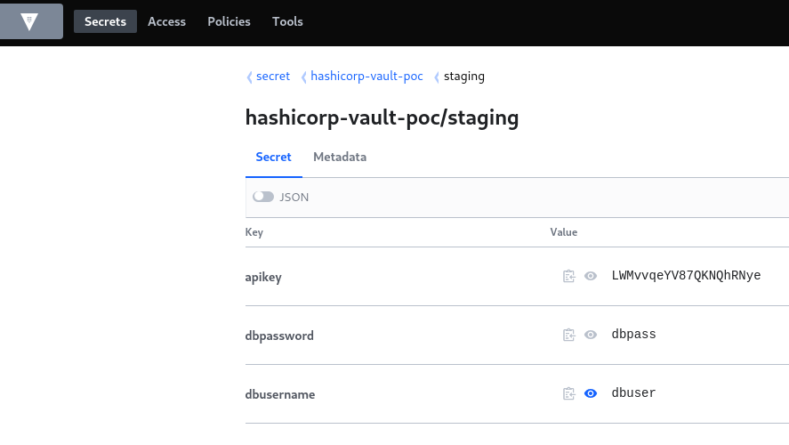
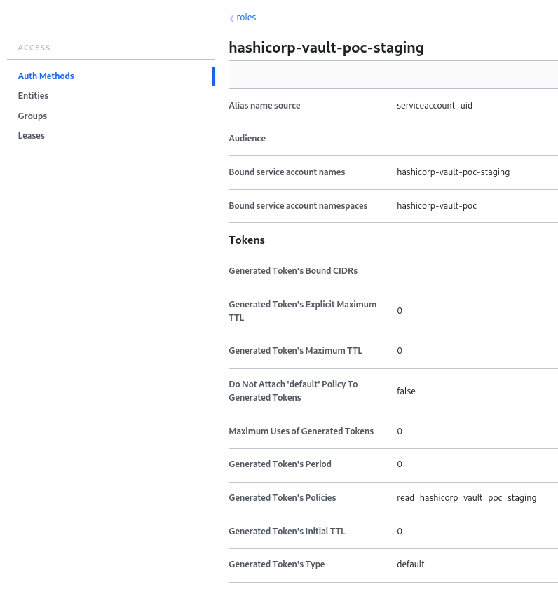
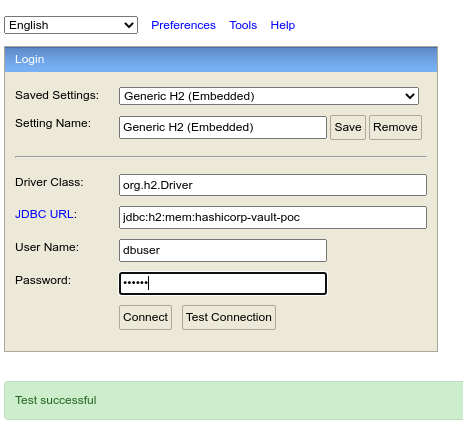

# hashicorp-vault-poc

This is a PoC for checking, testing and learning about the integration of Hashicorp Vault with a Kubernetes deployment.

## Purpose of this project

The purpose of this project is to play around and learn about the integration features of a Spring Boot application with
Hashicorp Vault and to get to know about advantages and disadvantages.

## Architectural overview

### Spring Boot application

This project consists of a Spring Boot application that provides a RESTful endpoint. The application also provides an
embedded H2 in-memory database with the webinterface being enabled. The application is deployed in a Kubernetes cluster.
Database credentials (username and password) are retrieved from a Hashicorp Vault instance running in the same cluster.
Furthermore the provided endpoint is secured with an API key, also retrieved from the Hashicorp Vault.

This setup enables auto-configuration of database credentials and endpoint security which can be validated via the
H2-console and an API call against the provided endpoint. Two profiles - staging and production - can be activated to
test the functionality with environment specific settings.

### Hashicorp Vault instance

The Hashicorp Vault instance is deployed in the namespace "security" and has the name "vault". A key-value store with
context "secret" is enabled for storing credentials for the application. Authentication is done with the Kubernetes
authentication method.

## Connecting the Spring Boot application to Hashicorp Vault

### Configuration of the vault secrets

All vault secrets are added to a key-value store with the context "secret". The path-schema for the vault secrets is
`/hashicorp-vault-poc/{profile}`. For the staging environment the following secrets are added to the path
`/hashicorp-vault-poc/staging`:



For the production profile the secret's path is `/hashicorp-vault-poc/production`.

A policy is added restricting access to the relevant vault secrets for each profile:

`read_hashicorp_vault_poc_staging`:
```
path "secret/data/hashicorp-vault-poc/staging" {
    capabilities = ["read"]
}
```

`read_hashicorp_vault_poc_production`:
```
path "secret/data/hashicorp-vault-poc/production" {
    capabilities = ["read"]
}
```

### Configuration of the Kubernetes authentication

Authentication against the vault is done by the Kubernetes authentication type using the service-account of the deployment. In
the vault the Kubernetes authentication type is enabled and one role is added for each application-profile. Additionally
to each role the corresponding vault access policy is assigned.

Example for the staging profile:



### Setting up the application to retrieve secrets from the vault

All parameters regarding the connection of the application to the vault are set in the file `bootstrap.yml` which is
evaluated on application start before the application context is loaded. If some parameters regarding the deployment of
the vault, e.g. the namespace, are different on your environment, those settings in `bootstrap.yml` must be changed
accordingly. The application automatically checks the following paths for secrets to load:

- `/hashicorp-vault-poc/{profile}`
- `/hashicorp-vault-poc`
- `/application/{profile}`
- `/application`

It will only find the first one and return a 403-error for the other ones. This can be ignored as this is the
default-setting for Spring Vault.

If everything is working the application retrieves the secrets

- `dbusername`
- `dbpassword`
- `apikey`

that are referenced in the `application.yml` for configuration of the database and the API endpoint.

## Secret validation

To verify that the secrets have been retrieved from the vault and processed correctly you can check this by either
performing an API-call against the endpoint using the chosen API-Key as authentication method:

`curl --location --request GET 'https://hashicorp-vault-poc.example.com/api/v1/helloworld' --header 'X-Api-Key:
LWMvvqeYV87QKNQhRNye'`

or by logging into the H2-console with the credentials defined in the vault:

